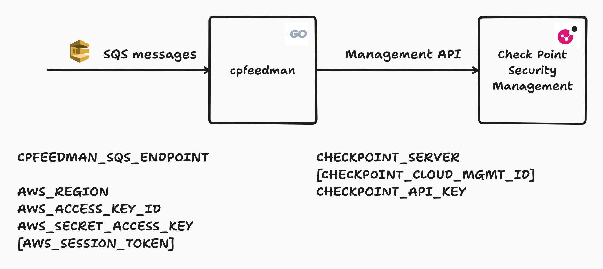

# cpfeedman - notifications about Check Point Network Feeds updates

Tool consumimg Network Feedd update notifications on AWS SQS service queue
and ***triggering feed update*** on Security Gateways using Check Point Management API.

## Architecture diagram

### Configuration

Configuration is done using environment variables. The following variables are required:

| Purpose                | Env Var                | Description                                                      |
|------------------------|------------------------|------------------------------------------------------------------|
| Notification scope | `CPFEEDMAN_NOTIFIED_GATEWAYS` | Comma-separated list of Security Gateways to notify about updates - e.g. "gw10,gw20" |
| AWS SQS         | `CPFEEDMAN_SQS_ENDPOINT`        | URL of the AWS SQS queue to consume notifications from           |
| AWS Authentication         | `AWS_ACCESS_KEY_ID`    | AWS access key for authentication                                |
| AWS Authentication         | `AWS_SECRET_ACCESS_KEY`| AWS secret key for authentication                                |
| AWS Authentication             | `AWS_REGION`           | AWS region where the SQS queue is located                        |
| Check Point Management API | `CHECKPOINT_SERVER`     | Address or hostname of the Check Point Management API                        |
| Check Point Management API    | `CHECKPOINT_CLOUD_MGMT_ID`        |Optional: Smart-1 Cloud management ID of tenant                                  |
| Check Point Management API | `CHECKPOINT_API_KEY`    | Check Point API key

### Notes                                 |